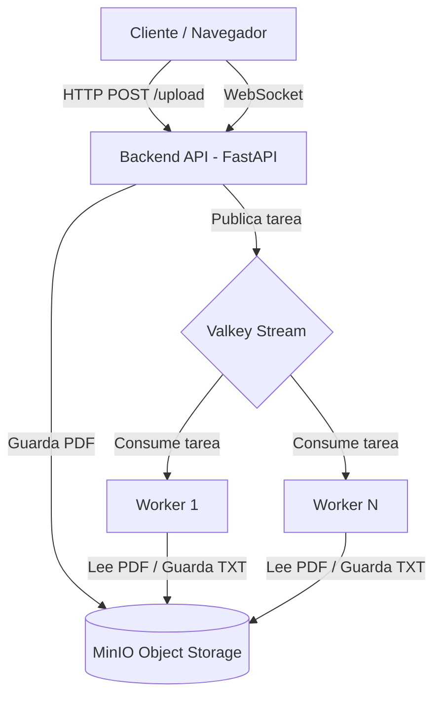

# Conversión Distribuida de Archivos PDF a TXT

## Integrantes

- Trinidad Perea
- Perla Valerio
- Emmanuel Longhino

---

## 1. Descripción del Proyecto

Este sistema permite a los usuarios subir archivos PDF, ya sea de forma individual o agrupados en archivos ZIP, para obtener su contenido en formato de texto plano de manera asíncrona.

### Justificación técnica

La extracción de texto desde archivos PDF es una tarea intensiva en CPU. Si se realizara de forma síncrona en el servidor principal, el rendimiento del sistema se degradaría significativamente ante múltiples solicitudes concurrentes.

Por este motivo, el procesamiento se delega a Workers independientes que consumen tareas desde una cola de mensajes. Esta arquitectura permite:

- Escalabilidad horizontal.
- Mejor utilización de recursos.
- Mayor tolerancia a fallas.
- Desacoplamiento entre recepción y procesamiento de tareas.

---

## 2. Arquitectura del Sistema

El sistema sigue una arquitectura distribuida desacoplada basada en el patrón **Pipeline**.



### Componentes principales

- **Frontend:** interfaz web para carga de archivos y seguimiento del procesamiento.
- **Backend:** API desarrollada con FastAPI encargada de recibir solicitudes y publicar tareas.
- **Valkey:** sistema de mensajería utilizado para desacoplar productores y consumidores.
- **Workers:** procesos encargados de convertir PDFs a TXT.
- **MinIO:** almacenamiento distribuido de archivos.
- **Kubernetes:** plataforma de orquestación de contenedores.

---

## 3. Tecnologías Utilizadas

### Backend

- Python
- FastAPI
- pdfminer

### Frontend

- HTML5
- CSS3
- JavaScript
- jQuery

### Middleware de Mensajería (MOM)

- Valkey Streams

### Almacenamiento Distribuido (SAD)

- MinIO

### Orquestación

- Kubernetes (RKE2)
- MetalLB

### Contenedor

- Docker

---

## 4. Flujo de Procesamiento

### Conversión de PDF Individual

1. El usuario sube un archivo PDF desde el navegador.
2. El Backend recibe el archivo y genera un identificador único (`UUID`).
3. El PDF se almacena en MinIO.
4. El Backend publica una tarea en un Stream de Valkey.
5. El estado inicial se registra como **Pendiente**.
6. El Backend devuelve el `job_id` al cliente.
7. El Frontend abre una conexión WebSocket asociada a dicho identificador.
8. Un Worker consume la tarea desde Valkey.
9. El Worker actualiza el estado a **Procesando**.
10. El Worker descarga el PDF desde MinIO.
11. Se extrae el texto utilizando `pdfminer`.
12. El archivo TXT resultante se almacena nuevamente en MinIO.
13. El estado se actualiza a **Completado**.
14. El Backend detecta el cambio de estado y lo envía al cliente mediante WebSocket.
15. El Frontend actualiza la interfaz y habilita la descarga del resultado.

### Flujo Simplificado

```text
Cliente
   |
   | Upload PDF
   v
Backend
   |
   | Guarda archivo
   v
MinIO
   |
   | Publica tarea
   v
Valkey Stream
   |
   | Consume
   v
Worker
   |
   | Genera TXT
   v
MinIO

Worker -> Valkey (Estado)
Backend -> WebSocket -> Cliente
```

---

## 5. Comunicación en Tiempo Real

Para informar el avance de las conversiones sin realizar consultas periódicas constantes, se utilizan **WebSockets**.

### Estados reportados

- Pendiente
- Procesando
- Completado
- Error

### Beneficios

- Menor tráfico de red.
- Actualización inmediata de la interfaz.
- Mejor experiencia de usuario.
- Comunicación bidireccional persistente.

---

## 6. Despliegue en Kubernetes

### Configuración

1. Crear ConfigMaps y Secrets necesarios.
2. Desplegar servicios de infraestructura:
   - Valkey
   - MinIO
3. Desplegar la aplicación:
   - Backend
   - Workers
   - Frontend
4. Verificar el estado de los Pods y Services.

### Verificación

```bash
kubectl get pods -n pdf-converter
kubectl get svc -n pdf-converter
```

---

## 7. Pruebas y Benchmarking

### Funcionalidad

- Subir un PDF individual.
- Verificar que el estado evolucione de:
  - Pendiente
  - Procesando
  - Completado

### Resiliencia

- Simular la caída de un Worker durante el procesamiento.
- Verificar que la tarea permanezca disponible para ser reprocesada.

### Escalabilidad

- Incrementar el número de réplicas de Workers.
- Evaluar el comportamiento del sistema bajo múltiples solicitudes concurrentes.

---

## 8. Características de la Solución

- Procesamiento asíncrono.
- Arquitectura desacoplada.
- Comunicación en tiempo real mediante WebSockets.
- Almacenamiento persistente con MinIO.
- Escalabilidad horizontal de Workers.
- Despliegue sobre Kubernetes.

---

## 9. Trabajo Académico

Proyecto desarrollado para la materia **Sistemas Distribuidos** de la **Licenciatura en Ciencias de la Computación**, **Universidad Nacional de Cuyo (UNCuyo)**.